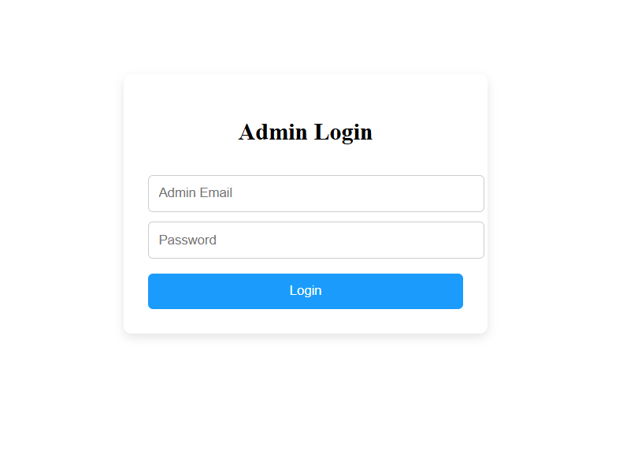
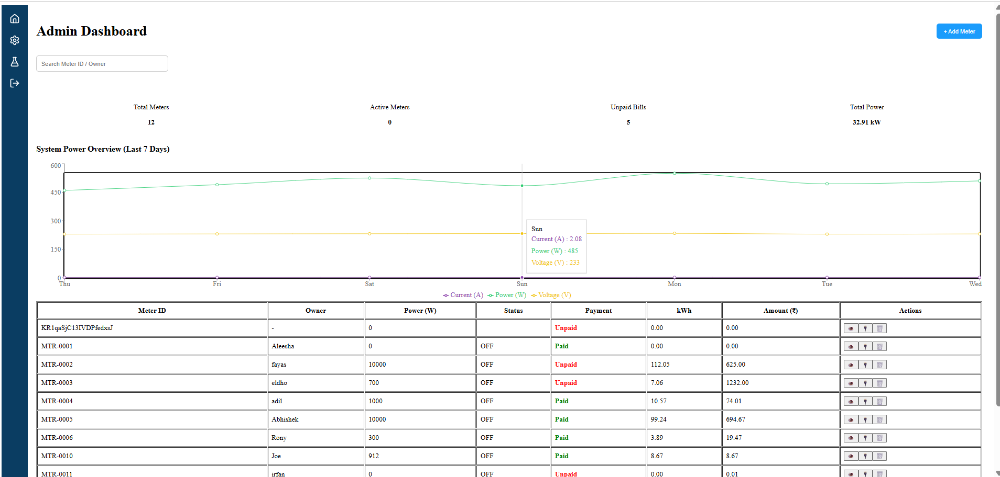
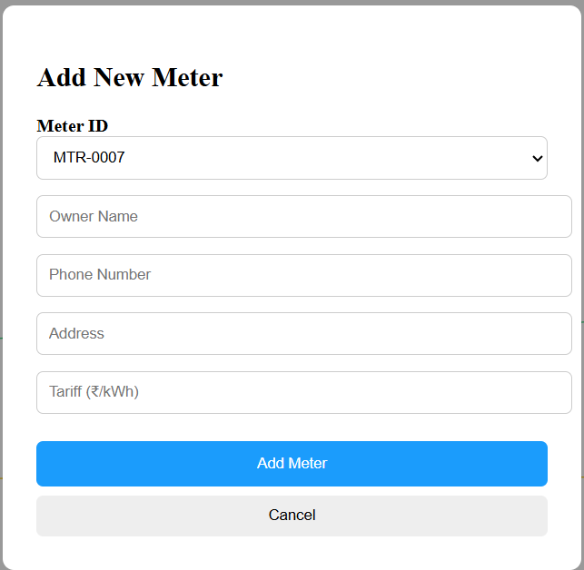
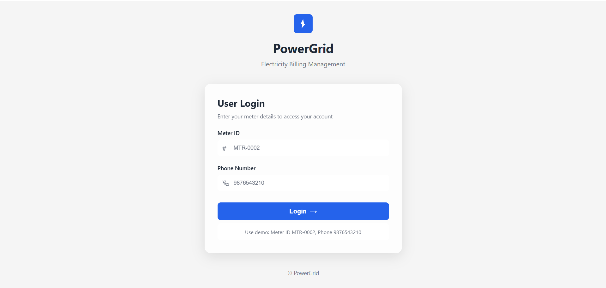
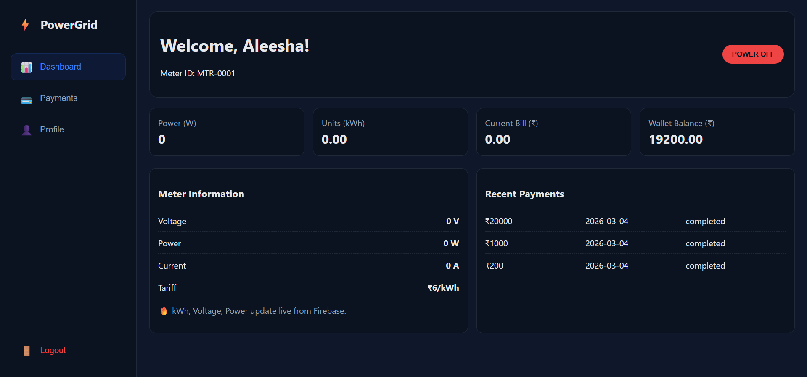
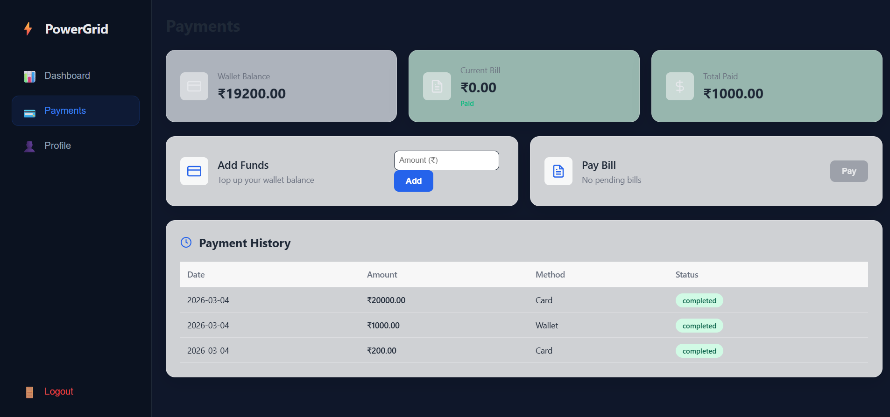
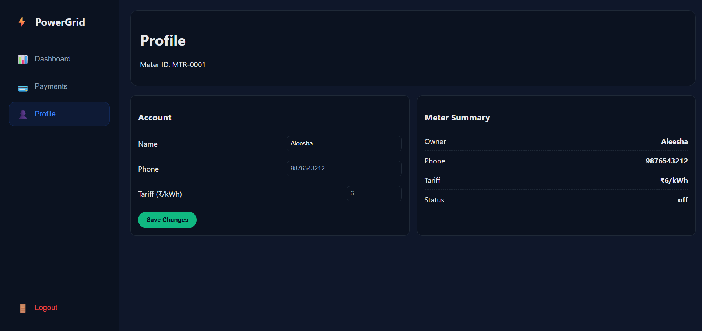

# Electricity Billing System

This repository contains a two-part application for managing and viewing electricity consumption and billing.

## Project Structure

- `meter-admin/` - Admin dashboard built with React and Vite. Includes features for adding meters, viewing meter data, and configuration. It uses Vite for development and includes ESLint setup.
- `user-page/` - User-facing frontend created with Create React App along with a Node/Express backend in `user-page/backend/` for authentication, payments, and dashboard data.

Each subproject has its own README with details on setup and available commands. Refer to those for development instructions specific to the frontend or backend.


## Screenshots

### Admin Login


### Admin Dashboard


### Add New Meter


### User Login


### User Dashboard


### Payments Page


### Profile Page



## Setup

1. **Install dependencies**
   - For the admin dashboard:
     ```bash
     cd meter-admin
     npm install
     ```
   - For the user page frontend:
     ```bash
     cd user-page
     npm install
     ```
   - For the user page backend:
     ```bash
     cd user-page/backend
     npm install
     ```

2. **Environment Configuration**
   - Copy `user-page/backend/config.env.example` to `config.env` and set environment variables (e.g., database URL, JWT secret).

3. **Run Servers**
   - Start the admin dashboard:
     ```bash
     cd meter-admin
     npm run dev
     ```
   - Start the user page frontend:
     ```bash
     cd user-page
     npm start
     ```
   - Start the backend service:
     ```bash
     cd user-page/backend
     npm run start
     ```

## Contributing

Please ensure that you follow the established code style in each subproject. Linting and formatting tools are configured in respective subfolders.

## License

Specify license information here if applicable.
